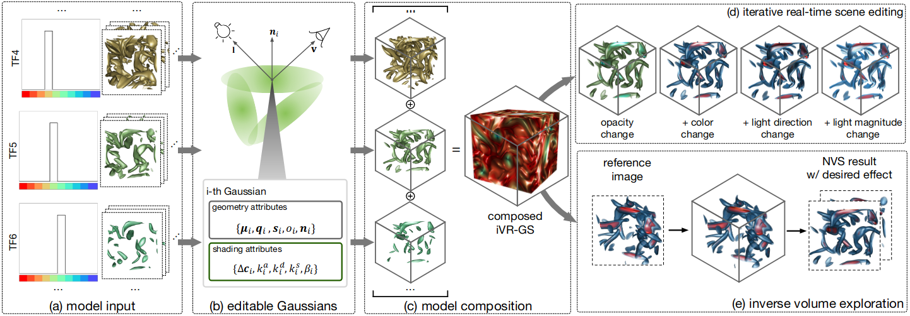

# iVR-GS: Inverse Volume Rendering for Explorable Visualization via Editable 3D Gaussian Splatting

## Description
This is the implementation for iVR-GS: Inverse Volume Rendering for Explorable Visualization via Editable 3D Gaussian Splatting.

## Setup

```bash
git clone https://github.com/TouKaienn/iVR-GS.git
conda create --name iVRGS python=3.9
conda activate iVRGS

#* install necessary dependencies
cd iVR-GS
pip install -r requirements.txt
pip install -e ./submodules/diff-gaussian-rasterization
pip install -e ./submodules/simple-knn  
```

## Dataset structure
We organize the datasets like this:

```
.
└── combustion
    ├── TF01
    │   ├── test
    │   ├── train
    │   ├── transforms_test.json
    │   ├── transforms_train.json
    │   └── transforms_val.json
    ├── TF02
    ├── TF03
    ...
```
where ``combustion`` is the volume dataset name, ``TF01`` is the first sampled transfer function (TF), ``test`` and ``train`` are two dictionary that contatining the testing and training images, ``.json`` files stores the camera poses.

We release a combustion dataset with 10 basic TFs and the model ckpts [here](https://drive.google.com/drive/folders/1FRDCuCfgW45XQ8vg19gsI38WZOjzb26U?usp=sharing), you can download the dataset and ckpts put them into ``Data`` and ``output`` folder, respectively. (Note: compared with the original implementation we used in the paper, we updated a little bit to obtain higher quality reconstruction on the specular part. To reproduce the results with the model ckpts we provide here, please use the implementation of this commit ``82d2190``. We will replace the model ckpts using the latest implementation as soon as possible)

## Training and Evaluation
The following code will train iVR-GS on the combustion dataset with 10 basic TFs:
```bash
bash exp_scripts/combustion.sh
```
After training, you can render all basic models and evaluate PSNR usign the following commands:
```bash
bash exp_scripts/render.sh
```
You can also use our GUI to compose all basic models and conduct editing:
```bash
bash exp_scripts/gui.sh
```


## Acknowledgement
A special thanks to the open-source community, especially the following amazing projects:
- [reduced-3dgs](https://github.com/graphdeco-inria/reduced-3dgs)
- [Relightable3DGaussian](https://github.com/NJU-3DV/Relightable3DGaussian)
- [DearPyGui](https://github.com/NJU-3DV/Relightable3DGaussian)

